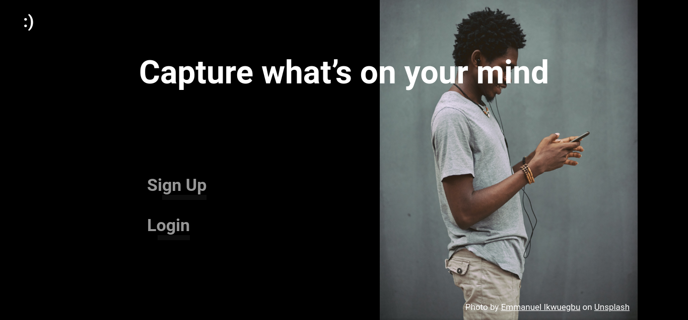
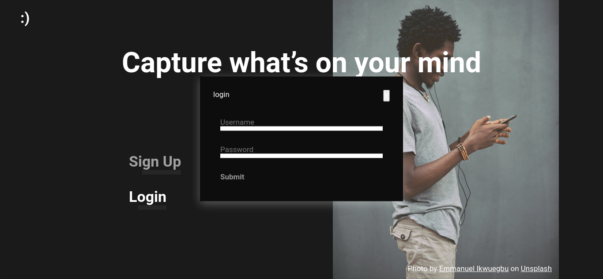
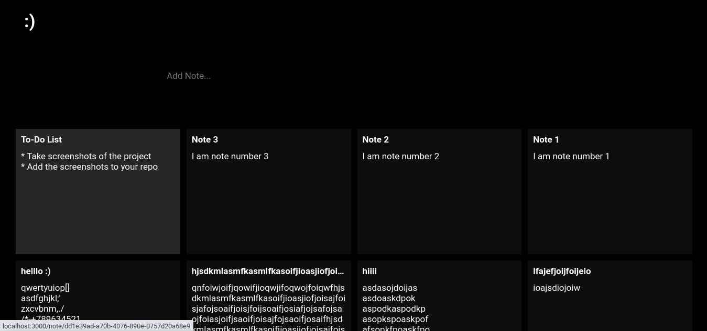
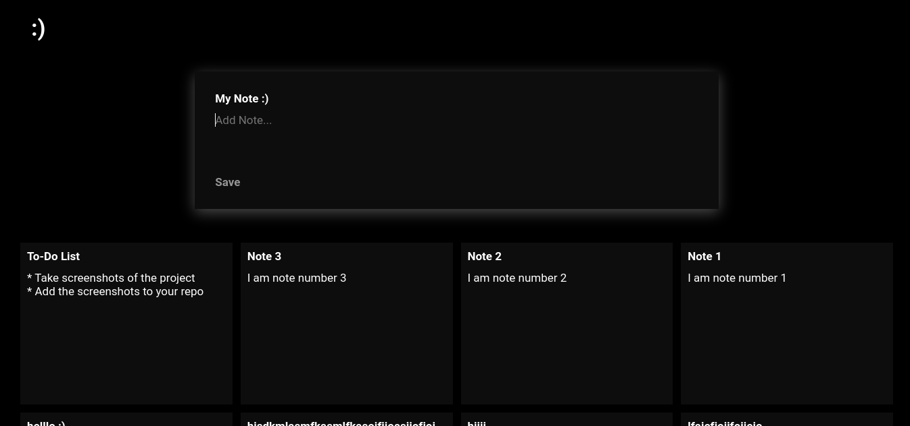
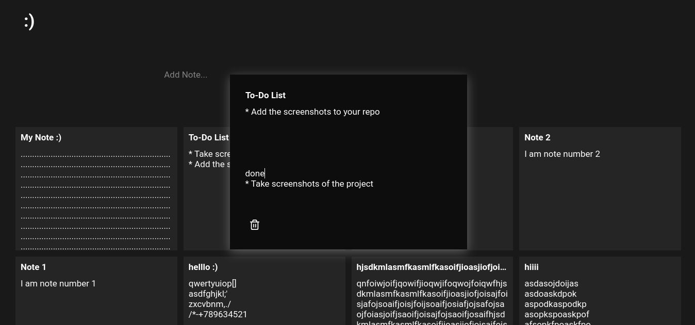

# Screenshots







# Technology used

- React (Hooks, React-Router)
- Node.js , Express.js , GraphQL
- GraphQL using apollo (client/server)
- PostgreSQL (typeorm)

# Features

- Responsive design
- Login and Signup
- Create, read, update and delete notes

# Installation

## Clone the project

```pash
git clone git@github.com:yasser570/note-taking-app.git
```

## PostgreSQL

- Create a new Postgres Database

```pash
psql
```

```sql
CREATE DATABASE notes_app;
```

- update [ormconfig.json](backend/ormconfig.json) file to match your connection

## backend

- Install dependencies

```pash
cd backend
npm install
```

- build and run the server

```pash
npm run start
```

## fontend

- Install dependencies

```pash
cd frontend
npm install
```

- build and start

```pash
npm run build
npm install -g serve
serve -s build
```
